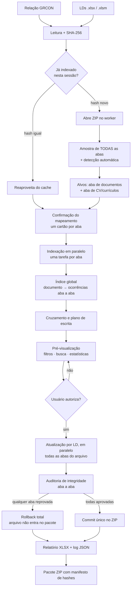
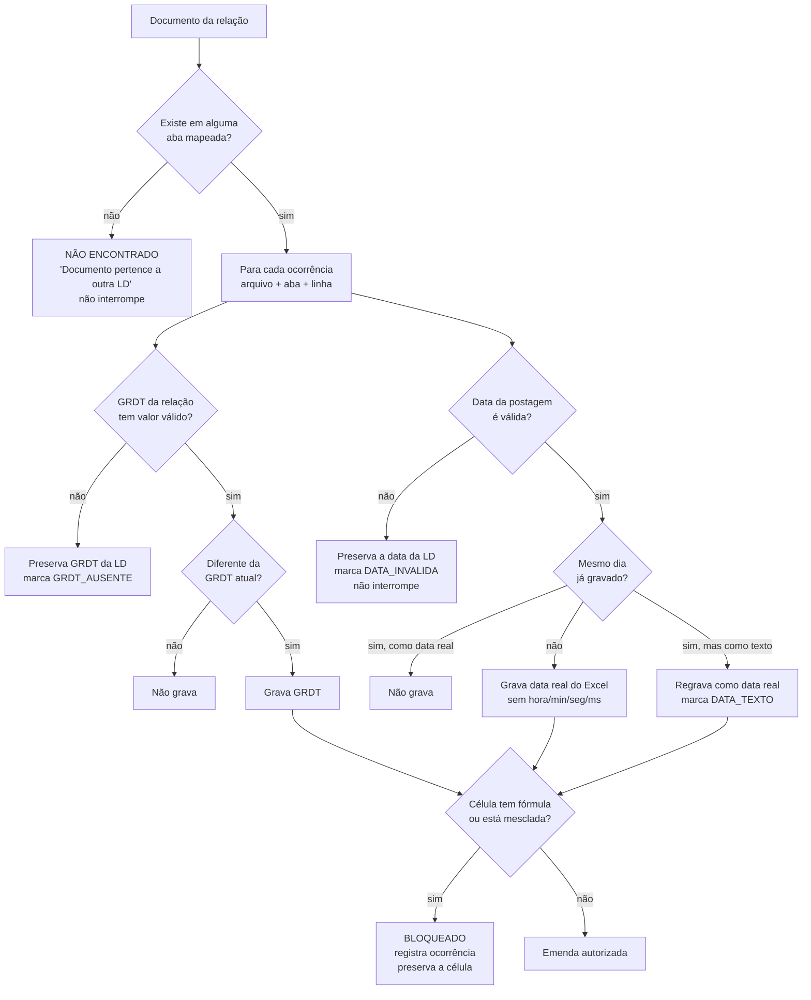

# Vincula 2.0 — Fluxo de processamento

## 1. Visão geral



## 2. Pipeline por LD

```
      página                        worker (afinidade fixa por arquivo)
        │
  ler File → SHA-256
        │  bytes transferidos (sem cópia)
        ├───────────────────────────►  open
        │                                ├─ JSZip.loadAsync
        │                                ├─ sharedStrings + styles
        │                                ├─ amostra de todas as abas (LD)
        │                                ├─ classifica papéis (documentos, CV)
        │  ◄─ metadados + alvos ──────────┴─ propõe um mapeamento por aba
        │
  usuário confirma o mapeamento de cada aba
        │
        ├───────────────────────────►  indexLd  (uma chamada por aba)
        │                                ├─ lê XML da aba
        │                                ├─ varredura por offsets (só 3 colunas)
        │                                ├─ monta entries com a aba de origem
        │  ◄──── entries ─────────────────┴─ libera o XML
        │
  índice global + análise + plano (cada item sabe sua aba)
        │
        ├───────────────────────────►  apply   (todas as abas do arquivo)
        │                              para cada aba com itens:
        │                                ├─ relê XML da aba
        │                                ├─ snapshot + SHA-256
        │                                ├─ inspeciona cada célula-alvo
        │                                ├─ acumula emendas
        │                                ├─ render + auditoria de integridade
        │                                ├─ deixa a aba pendente + libera o XML
        │                              ao fim, se todas passaram:
        │  ◄─ bytes transferidos ─────────┴─ commit único + DEFLATE 9
        │
  relatório · pacote · downloads
```

## 3. Decisão por documento



## 4. Situações e marcadores

Um registro tem **uma** situação e **zero ou mais** marcadores — informação que a v1 perdia ao
usar um campo único (um documento duplicado *com data inválida* aparecia só como duplicado).

| Situação | Significado |
|---|---|
| `ATUALIZAR` | pelo menos um campo autorizado será gravado |
| `SEM_ALTERACAO` | valores já conferem; nenhuma escrita executada |
| `NAO_ENCONTRADO` | documento pertence a outra LD |
| `BLOQUEADO` | célula-alvo protegida por fórmula, mesclagem ou linha inexistente |
| `ERRO` | falha na gravação do arquivo |

| Marcador | Significado |
|---|---|
| `DUPLICADO_RELACAO` | documento repetido na relação; venceu a última ocorrência |
| `DUPLICADO_LD` | documento repetido nas LDs ou em mais de uma aba da mesma LD; todas as ocorrências atualizadas |
| `DATA_INVALIDA` | data da postagem inválida; data da LD preservada |
| `GRDT_AUSENTE` | GRDT sem valor na relação; GRDT da LD preservada |
| `DATA_TEXTO` | data estava como texto e foi convertida em data real do Excel |

O filtro da pré-visualização casa tanto situação quanto marcador: *Duplicados* traz os dois tipos
de duplicidade, *Data inválida* traz o marcador correspondente.

## 5. Etapas e barras de progresso

O motor emite seis fases; a interface as agrupa nas quatro barras do vocabulário do usuário.

| Fase do motor | Barra | O que acontece |
|---|---|---|
| `leitura` | Leitura | `File` → bytes → SHA-256 → abertura do ZIP → amostra das abas |
| `indexacao` | Indexação | varredura das colunas mapeadas de cada aba, construção dos índices |
| `analise` | Indexação | índice global, cruzamento, montagem do plano |
| `atualizacao` | Atualização | emendas, auditoria de integridade, commit |
| `relatorio` | Compactação ZIP | relatório XLSX + log JSON |
| `compactacao` | Compactação ZIP | pacote final com manifesto |

Indicadores em tempo real: LD processadas, documentos processados, encontrados, alterados,
células gravadas, velocidade (doc/s) e ETA calculada pelo desempenho corrente.

## 6. Compressão

| Conteúdo | Nível | Motivo |
|---|---|---|
| XLSX/XLSM gerados | 1 | já são contêineres comprimidos; recomprimir custa tempo sem reduzir tamanho |
| Log JSON e manifesto | 9 | texto puro, alta taxa de compressão |
| Aba modificada dentro do XLSX | 9 | XML puro, comprime muito bem |

Prioridade declarada: integridade → menor tamanho → tempo.
